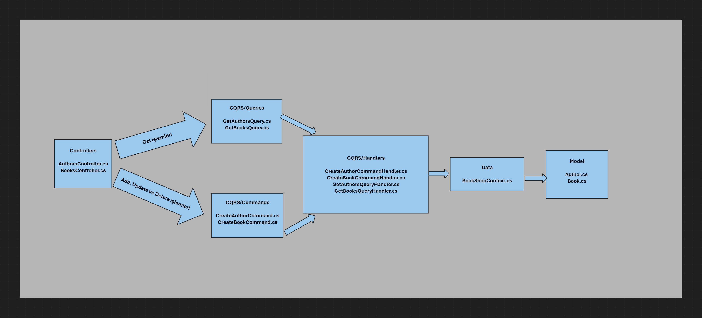
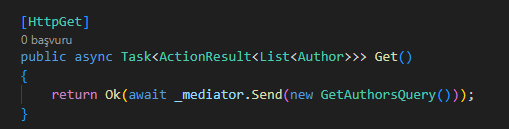
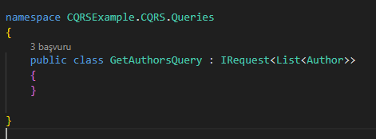
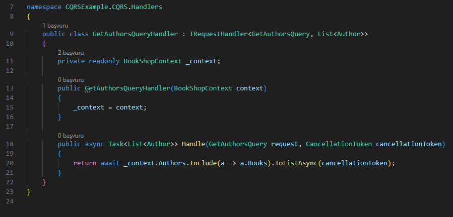

# CQRS

### Kaynaklar

* [Gencay Yıldız Blog](https://www.gencayyildiz.com/blog/cqrs-pattern-nedir-mediatr-kutuphanesi-ile-nasil-uygulanir/)
* [Gencay Yıldız Video](https://www.youtube.com/watch?v=LnIEFgs4iAA)
* [TechBuddy](https://www.youtube.com/watch?v=GDKy2xZsZhs)


### Neden?

CQRS (Command Query Responsibility Segregation) komut ve query kısımlarını ayır demek. <br> kafamda oturtmakta yaşadığım en büyük sorun niye bu kadar ayırıyozdu. Bir türlü önyargıyı atıp kavrayamıyordum. Fakat Gençay Yıldız'ın videosunda anlattığı çok güzel oturttu. Büyük sistemlerde add update ve delete ile get işlemleri arasında maliyet farkı çok fazladır. (maliyet denen şey kullanılan cpu, süre gibi sunucu tarafındaki kaynak tüketimidir) bu yüzden get için ayrı sunucu kullanılır. Ekleme silme için ayrı. sonrasında bunlar arasında eşitleme yapacak farklı sistem kurulur vs vs. aslında burada bu kadar parçalayarak size baya özerklik sağlamakta. istersen her get için farklı sunucu kullan (buda saçmada örnek verdim). buna ilerde tekrardan değiniyorum ama başa yazmak istedim ilerde okursam aklıma gelsin diye.

command => Veride değişim yapan işlemler. Add, Update ve Delete gibi
<br>
query => Veride değişim olmadan okuma, inceleme ve görüntüleme gibi işleri yapan sorgulardır.

<br>

`CQRS`'in asıl maksadı bu sorguları ayırmasıdır. `ANLADIĞIM` kadarıyla command ve query sorgularını ayırarak iki sorgununda farklı veritabanında olması gibi özelleştirilebilir kontrolleri arttırır. Bu sayede gerekli performans ayarlamaları daha kolay olur. 

<br>

gelen isteği 4 farklı kategoriden birine eşleriz

* Request Command
* Response Command
* Request Query
* Response Query

bunlardan birine eşler ve sonra isteği `Handler` alanına atar. Handler türkçede işleyici, eğitici anlamı var. Handler alanında kategorisine göre veriyi işler. 


### Proje Aşaması

burada şuan için chatgpt ile ilerleyeceğim.



Burada tek projede yaptığım sistemi gösterdim açıkçası hala Onion Architecture için kafamda kuramadım. Resmi özetlersek gelen istek isteğine göre ikiye ayrılır. Handler halleder. Handler nasıl hallediyor orada `MediatR` devreye girmekte. kendisi aradaki bağları oto yapmakta. Birazdan kodlarla anlatmaya çalışacağım. Bende taze öğrendim yanlış olabilir.

<br>
<br>

### Veritabanını ve gerekli ayarlamaları ayarlayalım

Proje zaten burada olduğu için tek tek kod koymalık salaklık yapmayacağım. Önemli kısımlar var. Program.cs içinde ayarladığım sistem ile veritabanı direk hazır oluyor her açılışta. 

```
// veritabanına bağlanma 
Console.WriteLine("Database açılıyor.");
builder.Services.AddDbContext<BookShopContext>(opt =>
{
    opt.UseSqlServer("Data Source=localhost;Initial Catalog=SQRS_Example;Integrated Security=True;Connect Timeout=30;Encrypt=True;Trust Server Certificate=True;Application Intent=ReadWrite;Multi Subnet Failover=False");
    opt.UseLoggerFactory(LoggerFactory.Create(builder =>
    {
        builder.AddConsole();
        builder.SetMinimumLevel(LogLevel.Warning); //açılıştaki bir sürü konsol çıktısını önlemek için
    }));
    opt.UseQueryTrackingBehavior(QueryTrackingBehavior.NoTracking);
});
```

veritabanını açar connection string kısmını değiştirmeyi unutmayın. alttaki kodlar ise ilki gereksiz log sonuçları ile konsolu kalabalık tutmanın önüne geçmekte. alttaki ise tüm sorgularda `AsNoTracking();` varmış gibi takibi bırakır ek performans sağlar tabi bazı yerlerde gerekebilir burada rahatça koydum siz dikkat edin. devamında `program.cs` içinde veritabanını her açılışta sıfırlayan kodlar var onlar şuan anlatmalık önemli değil.


<br>
<br>

```
//mediatr ekleme
builder.Services.AddMediatR(cfg => cfg.RegisterServicesFromAssembly(typeof(Program).Assembly));
```

burada mediatr framework eklentisini tanıtıyoruz. 

```
builder.Services.AddControllers()
    .AddJsonOptions(options =>
    {
        options.JsonSerializerOptions.ReferenceHandler = ReferenceHandler.Preserve;
    });

```

çıktılarda hata oluyordu onu önlüyor istersen kaldır ve get işlemi almayı dene anlarsın. 

<br>
<br>

### CQRS

kendi yolumla direkt işleyişi anlatalım. <br>


<br>
`Controllers/AuthorsController::Get()` methoduna istek geldi diyelim. Burada Mediatr kütüphanesi tüm kendi interfaceini kullanan sınıfları tarayarak bulduğu için doğrudan ona verilen sınıf olan `GetAuthorsQuery` içinden 



<br>

buradaki yapıya bakacak. Bu yapı diyorki sen Gelen isteğe `List<Author>` döneceksin. İşte ben burada bir durdum. Ee dedim sonra. Aslında tekrar etmem gerekirse `builder.Services.AddMediatR(cfg => cfg.RegisterServicesFromAssembly(typeof(Program).Assembly));` bu kod ile tüm mediatr kütüphanesini kullanan sınıflar otomatik eklenir. yani bizim birde bu sorguları çalıştıran Handler kısmımız var. 

<br>



<br>

mediatr tüm sınıflara bakıyor. Burada satır 9'da `GetAuthorsQuery` almakta. Ayrıca geri dönüş tipide belirtilmekte. mediatr diyorki bunun handlerı bu bunu çalıştıracaz.20. satırdaki kod çıktısı olarak elimize `Books` değişkenide doldurulmuş `List<Author>` dönecek. Bunu doğrudan bize `Controller` içinde geri verecek. 

<br>
<br>

eğer yanlış anlamadı issem sistem bu şekilde. Create işlemlerinde de sistem aynı. Şimdi burada hata alıyorsun. Json hatası o yüzden program.cs içine json kodunu koyduk. Json kodsuz çözmek için (kijson kodsuz çözmek daha iyi olur) Handler içinde Dto dönüşümünü mapper ile yapıp geriye dto dönmelisin.

<br>
<br>

şuanki bilgime göre commandlar ve queries ler en içe yada bir üste konsa repository içinde de handler olabilir bunu uygulamadan bilemem. Başta hiç anlam veremedim zaten çok katmanlı onion arc kullanıyorum her şey güzeldi CQRS ne işime yarayacak diyordum fakat mesele şu her şeyin özel katmanı olması zaten iyidir ek olarak her komuta ayrı bir `context` vermektesin. Yani her biri için ayrı veritabanı koy istersen. dediğim saçma ama örnek olarak. çoklu veritabanı işlerinde çok iyi olur bu sistem. Lakin mimari olarak hala tam oturtamadım yinede mediatr ile otomatik tarayarak eklemesi sisteme çok güzel iş.

<br>

sırada redis vs var vakitte az ben kaçar. Kendime not: veritabanı silme ve yükleme kısmını ilk sefer sonrası yoruma al gereksiz süre yemekte


