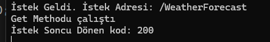
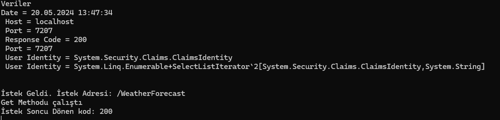

* [Gençay Yıldız Video Anlatımı](https://www.youtube.com/watch?v=BdNZ9gzsQdg)
* [mustafaonurtasdemirr.medium](https://mustafaonurtasdemirr.medium.com/middleware-nedir-ecdef1409fa)

# Nedir


resimdeki sistem `middleware`'dir. Middleware'ler 2 kısıma sahiplerdir. 1. Kısım ilk istek işlenerek ilerlerken çalışan kısım. 2. kısım ise işlem sonucu cevap döner iken çalışan kısım.

Örneğin gelen tüm istekleri listeleyecek bir middleware yapısı istersek 

<br>

Öncelikle `WeatherForecastController` içine ve başına `Console.WriteLine("Get Methodu çalıştı");` kodunu ekleyelim.

<br>

Sonra `Middleware` adlı bir klasör açalım ve içine `CustomMiddleware.cs` açıp kodları ekleyelim.

```
namespace MiddleWareExample.Middleware
{
    public class CustomMiddleware
    {
        private readonly RequestDelegate _next;

        public CustomMiddleware(RequestDelegate next)
        {
            _next = next;
        }

        public async Task InvokeAsync(HttpContext context)
        {
            Console.WriteLine($"İstek Geldi. İstek Adresi: {context.Request.Path}");

            await _next(context);

            Console.WriteLine($"İstek Soncu Dönen kod: {context.Response.StatusCode}");
        }
    }
}
```

son olarak `Program.cs` içindeki `var app = builder.Build();` kısmının hemen altında `app.UseMiddleware<CustomMiddleware>();` ekleyelim ve middleware kullanımını tamamlayalım.

<br>



<br>

resimdeki gibi bir konsol çıktısı gelecek. Bu sayede nereye istek gelşdiğini ve sonuçları öğrenebilriiz.

<br>

mesela farklı şeyler istersek

```
string message = "Veriler\n";
message += $"Date = {DateTime.Now}" + "\n";
message += $" Host = {context.Request.Host.Host} \n";
message += $" Port = {context.Request.Host.Port} \n";
message += $" Response Code = {context.Response.StatusCode} \n";
message += $" Port = {context.Connection.LocalPort} \n";
message += $" User Identity = {context.User.Identity} \n";
message += $" User Identity = {context.User.Identities.Select(u => u.Name + " - " + u.Label + " - " + u.NameClaimType.ToString())} \n";
message += $"\n";
Console.WriteLine(message);
Console.WriteLine($"İstek Geldi. İstek Adresi: {context.Request.Path}");

await _next(context);

Console.WriteLine($"İstek Soncu Dönen kod: {context.Response.StatusCode}");
```

içeriyi bu şeklil değiştirdiğimizde çıktımızda 



şekilde değişmekte. <br>

middleware avantajını bu örnek üzerindne anlatırsak. Bu örnekteki bilgileri her controller methodu üzerinden öğrenme imkanın vardı fakat her controller methodu için `Attribute` yazsan bile 100 method varsa 100 yere bu koymak zorunda kalman demekti. Burada ise tek dosya ve sadece program.cs içinte tek satırda aktif ederek hepsine uygulamış oldun. Burada `log` işlemide yaparak daha ayrıntılı loglar tutabilirisin.
