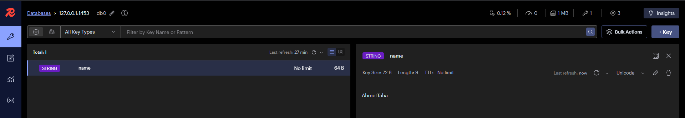

# Kaynak

* [Gencay Yıldız Redis Serisi (Katıla Özel)](https://www.youtube.com/watch?v=N1f0GzXs4-0&list=PLQVXoXFVVtp3_UlZu9qibcUzfm9ve3yVO)

* [Docker Redis](https://hub.docker.com/_/redis)
* [Redis Insight ](https://redis.io/insight/)


<hr>

Redisin amacı `caching` yaparak verileri bellekte saklayarak erişimi hızlandırır. Her veri değil ama ayarları var. 
<br>
bellekten veri çekmek hızlı ve veritabanınıda yormayı önleyeceği için performası arttırır. E ticarette anasayfayı caching ile memory de tutarsak her saniye gelen 100 kişi için sürekli db yormaktansa şaaaak diye memoryden verirsin. Sıklıkla erişim olacaksa cache kullanılır.
<br>
resim videoda memorye koyarsın fakat 

- güncellenen
- kişisel
- güvenlik için riskli
- özel
- geçici

veriler `CACHING` `YAPILMAZ`


<br>

cache yöntemleri olarak, `In-Memory` caching programın çalıştığı bilgisayarın raminde durur.

<br>

`distributed caching` dışardaki sunucularda yapılmasıdır.


<br>

### Docker

docker kurman lazım. Docker kurduktan sonra otomatik başlatmayı kapatmayı unutmayın tabi isterseniz. 
<br>
sonra docker sitesindeki 28.05.2024 tarhili olan `docker run --name some-redis -d redis` kodunu CMD(Komut Satırı) içine yapıştır. Default 6379 portudur. Bunu değiştirmek için `>docker run --name redis -p 1453:6379 -d redis` yaparsan burada default olan 6379 portunu 1453 portuna bağla dedik. Çalıştırdıktan sonra gerekli ise indirme yapıp geri kod verir.

<br>

örnek kod `86f2eb077c4f74a81dc71fe45bc1d4a8426d1a722bc4fec7582068967147ca61`


arayüzde şekildeki gibi gözükür.

<br>

komut satırından ise `docker ps` yazarak görürsün


sonra konteynıra bağlanmak için `docker exec -it 86f2eb077c4f redis-cli` yazarız burada `86f2eb077c4f` id'li docker konteynırına `redis-cli` aracılığı ile bağlan diyoruz.

<br>

`docker exec -it 86f2eb077c4f redis-cli --raw` Türkçe karakter sorunu için

<br>


sonra burada `PING` yazarsak ve karşılığında `PONG` alırsak konteynır başarılı demektir. 


### Redis Insight  (görselleştirme)


programı kaynak yerindeki link ile erişip indirip kurduktan sonra 


bu şekil ekran gelecek

<br>
arada 24 saatlik afk kalma var anlatımda bazı şeyler farklı olabilir kusura bakmayın
<br>


key ekle derseniz. 


bu şekilde ayarlarsan. solda eklenmiş şeklini göreceksin. manuel caching yapmış olduk aslında

<br>


### Redis

#### Veri Türleri

* String => metin yanına binary dosya resim vs saklayabilir.
* List => x verilerini liste tutar
* Set => Python set gibi içinde aynı olan veri tutmaz
* Sorted Set => sıralamalı set tutan tip
* Hash => Key-Value olarak veri tutar bir nevi Dict veri tipi
* Streams => log gibidir. eventleri sıra ile kaydedip işler. Tam anlamadım şuan ?
* Geospatial Indexes => Kordinat saklama tipi


#### String

* SET => Ekleme Yapar. `SET NAME Ahmet` => NAME keyine karşı Ahmet Yazar.
* GET => Okurma Yapar. `GET NAME` => NAME keyinden veri okur
* GETRANGE => Karakter Aralığı `GETRANGE NAME 1 2` 
* INCR & INCRBY => Arttırma. `INCR SAYI`
* DECR & DECRBY => Azaltma. `DECR SAYI`
* APPEND => Üzerine Ekleme => `APPEND NAME Taha`

Name ve Sayı Key burada

<br>




örnek gösterim.


#### List

* LPUSH => Başa Veri Ekle => LPUSH NAMES Ahmet Taha
* LRANGE => Verileri Listeleme => LRANGE NAMES 0 -1
* RPUSH => Sona Veri Ekleme => RPUSH NAMES Ali
* LPOP => İlk Veriyi Çıkar => LPOP NAMES
* RPOP => Son Veriyi Çıkar => RPOP NAMES
* LINDEX => Indexe Göre Datayı Getirme => LINDEX NAMES 1


#### SET

* SADD => Ekleme => SADD COLOR red blue green orange
* SREM => Silme => SREM COLOR blue
* SISMEMBER => Arama => SISMEMBER COLOR red
* SINTER => İki set arasındaki kesişimi verir => SINTER user1:BOOKS user2:BOOKS
* SCARD => Eleman Sayısını Döner => SCARD COLOR


#### SHORTED SET

* ZADD => Ekleme => ZADD TEAMS 1 A
* ZRANGE => Getirme => ZRANGE TEAMS 0 -1 || ZRANGE TEAMS 0 -1 WITHSCORES
* ZREM => Silme => ZREM TEAMS A
* ZREVRANK => Sıralama Öğrenme => ZREVRANK TEAMS B


#### HASH

* HMSET & HSET => Ekleme => HMSET EMPLOYEES NAME Ahmet || HSET EMPLOYEES NAME Ahmet => Employees burada keydir. Name verinin keyi ve Ahmet Değer. Aslında bu python üzerinden örneklendirirsek List[Dict[StringAd, VeriTipi]] gibi bir şey yine açıklaması liste halinde key-value tutar bunuda açıklarsam Employees listesinde key değeri Name olan Değeride Ahmet Olan eleman ekle diyorum. 
* HMGET & HGET => Getirme => HMGET EMPLOYEES NAME
* HDEL => Silme => HDEL EMPLOYEES NAME
* HGETALL => Her Şeyi Getir. => HGETALL EMPLOYEES


#### Not

Liste kısmında `Ayşe` isimli veriyi tutarken redis bunu `"Ay\xc5\x9fe"` olarak tutumuştu. Bunu çözmek için `docker exec -it 86f2eb077c4f redis-cli --raw`  sonunda `--raw` ekleyerek çözeriz. 


# .NET CORE In-Memory Cache

`AddMemoryCache` servisi eklenir. `IMemoryCache` referansı ile inject edilir. `Set` ve `Get` ile Cache işlemleri yapılır. `Remove` ile silinebilir. `TryGetValue` ile varsa veriyi getir dersin. Basittir.

<br>

`MemoryCacheExample` kısmında bunlar yapıldı o yüzden geçtim 

<br>

`Absolute Time` verinin ne kadar tutulacağına dair net süre verilmesidir. `Sliding Time` ise veriye ne kadar süre erişilmez ise o zaman sil demek için verilen süredir.


gibi

<br>

# .NET CORE Distributed Cache

`StackExchangeRedis` kütüphanesini ekle. `Microsoft.Extensions.Caching.StackExchangeRedis` adlı paket. `AddStackExchangeRedisCache` ile uygulamaya ekle. IDistributedCache refi ile al. `SetString` ile string ekle, `Set` ile Binary veri ekle, `GetString` ve `Get` ile cache verileri elde et. `Remove` ile cachlemeleri sil.


<br>

1 saattir `builder.Services.AddStackExchangeRedisCache();` yerine `builder.AddStackExchangeRedisCache();` yazıp niye hata veriyor diye tüm .net ailesine sövüyorum.

<br>


bu dockera göre program.cs dosyasında aşağıdaki işlem yapılır. evet 9 saat bu arada aniden işler çıkınca yarım yarım ilerliyoz.


bu şekil eklersin.


controllerı bu şekilde ayarladıktan sonra swagger ile Ahmet taha gönderin yalnız redis içinde de name adlı bir şeyler yaptık öncesinde onları silin hata veriyor gene 1 saat hata aradım. 

<br>


<br>


şekilde zaman ayarlamalarınıda yapabilirisin.


zamanlama sonrası çıktı şekildeki gibi olmakta.


### Pub/Sub

message broker özelliği vardır. Redis cli üzerinden pub-sub imkanı sağlar. Komut satırı ile iki pencere aç redis cli bağlantısını yap. 

<br>


<br>

` subscribe mychannel` şeklinde mychannel kanalına bağlanırız.


<br>

publish görevi için `publish mychannel hello` şeklinde mychannel kanalına hello mesajı gönderdik.

<br>


redis insight ile aşağıda gösterdim. burada galiba düm kanalları dinlemekte.


### Pub/Sub ile .NET CORE

Console Uygulaması içinde gösteriliyor örnekler ben üşendiğim için bunu api içinde yapacağım mantık arama o yüzden. Clean code işinede takılmayalım.


<br>

Tam bir görüntü örneği için şekildeki gibi yaptım bunu apide canlı dinlemesi olamaz yada ben bilmiyorum. (muhtemelen ben bilmiyorum). konsol çıktıları yakalamakta ama 


```
readonly ConnectionMultiplexer connectionMultiplexer = ConnectionMultiplexer.Connect("localhost:1453");
readonly RedisChannel redisChannel = new RedisChannel("mychannel", RedisChannel.PatternMode.Auto);

[HttpGet]
public async Task<IActionResult> SendMessage(string message)
{
    await connectionMultiplexer.GetSubscriber().PublishAsync(redisChannel, message);
    return Ok();
}
```
koddan anlaşılır gibi

### Redis Replication

Kendime Not: önceki kısımla araya 6 gün girdi o sebep ile ilerleyen ksımlarda anlatımda eksikler olabilir.

redis sunucusundaki verilerin güvenliğini sağlamaya yarar. 

<br>

replication saklama yapılan serveri çoğaltarak yedek alma aslında.

<br>

master yani orjinal ana sunucu denir. Diğer kopyalanan serverlara a slave adı verilir. slave arttıkça kaynak tüketimi artar. micro düzeyde master ve slave arası düzensizlik olabilir.

<br>

### Redis Sentinel

çok detay var ama temelde master sunucuda hata olursa slave yada slavelerden biri master yerine geçer bu ve bunun gibi hata yönetmelerine denmekte açıklama yazmadım ileri seviye ayarlama şuan gerekmediği için bilgi amaçlı bakındım


