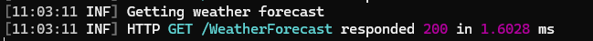
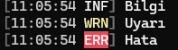
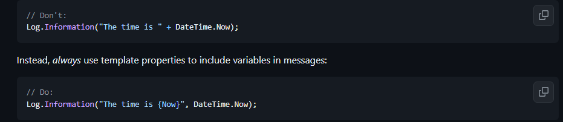

# Kurulumlar


### paketler
```
dotnet add package Serilog
dotnet add package Serilog.Extensions.Logging
dotnet add package Serilog.Sinks.Console
dotnet add package Serilog.Sinks.File
dotnet add package Serilog.Settings.Configuration
dotnet add package Serilog.Extensions.Hosting
dotnet add package Serilog.AspNetCore
dotnet add package Microsoft.Extensions.Configuration
dotnet add package Microsoft.Extensions.Configuration.Json
```
hepsi lazım değil ama garantiye aldım işi

### Program.cs


```
Log.Logger = new LoggerConfiguration()
    .ReadFrom.Configuration(builder.Configuration)
    .CreateLogger();

builder.Host.UseSerilog();
```

builder kısmına yukarıdaki kodu verin ve aşağıdaki kod ile app içinde aktif edin

```
app.UseSerilogRequestLogging();
```

### appsettings.json

```
"Serilog": {
    "Using": [ "Serilog.Sinks.Console", "Serilog.Sinks.File" ],
    "MinimumLevel": {
      "Default": "Information",
      "Override": {
        "Microsoft": "Warning",
        "System": "Warning"
      }
    },
    "WriteTo": [
      { "Name": "Console" },
      { "Name": "File", "Args": { "path": "logs/myapp.txt", "rollingInterval": "Day" } }
    ],
    "Enrich": [ "FromLogContext", "WithMachineName", "WithThreadId" ],
    "Properties": {
      "Application": "MySerilogApp"
    }
  }
```

`"AllowedHosts": "*"` kısmının altına yukarıdaki kod ile yapılandırmaları ekleyebilriisin.


# Kullanım 

```
[HttpGet(Name = "GetWeatherForecast")]
public IEnumerable<WeatherForecast> Get()
{
    _logger.LogInformation("Getting weather forecast");

    return Enumerable.Range(1, 5).Select(index => new WeatherForecast
    {
        Date = DateOnly.FromDateTime(DateTime.Now.AddDays(index)),
        TemperatureC = Random.Shared.Next(-20, 55),
        Summary = Summaries[Random.Shared.Next(Summaries.Length)]
    })
    .ToArray();
}
```

burada ` _logger.LogInformation("Getting weather forecast");` kısmı log işlemini yapmakta. 

# Çıktı



```
_logger.LogInformation("Bilgi");
_logger.LogWarning("Uyarı");
_logger.LogError("Hata");
```





# Özelleştirmeler

### Program.cs

```
//appsettings özelliklerini direkt içerden ayarlayabilirisin.
Log.Logger = new LoggerConfiguration()
            .MinimumLevel.Warning()
            .WriteTo.Console()
            .WriteTo.File("logs/myapp.txt", rollingInterval: RollingInterval.Day)
            .CreateLogger();
```

* `.MinimumLevel.Warning()` => gösterilecek min level (Warning dahildir.) Sıralaması ise
* `1. Verbose` Her şey dahil.
* `2. Debug` burası debug katmanı yazılımcı için olan bilgilerdir genellikle
* `3. Information` sistemin sorumlu olduğu işlerin bilgileri
* `4. Warning` uyarı kısmı
* `5. Error` Hata bildirisi
* `6. Fatal` sistem çöktü ama neden çöktü bildirisi

* `.WriteTo.Console()` => Consola basması için komut eklemez isen konsola basmaz

* `.WriteTo.File("logs/myapp.txt", rollingInterval: RollingInterval.Day)` => Klasör olmasada otomatik açar artık projede => logs altında myapp.txt içine proje yeniden başlasa bile silinmeyecek log atar. Örnek olarak aşağıda denemeler sırası alınan loglar var txt örneği olarak koyuyorum.

> `rollingInterval` => burada dosyaların kayır aralığı belirtilmekte yani burada günlük diyerek her gün için ayrı txt dosyası açılacak bu sayede daha düzenli olur.

> `outputTemplate: ` verilen kalıp ile çıktıları düzenleyebilirsin. Dökümanlarında verilen örnek `"{Timestamp:yyyy-MM-dd HH:mm:ss.fff zzz} [{Level:u3}] {Message:lj}{NewLine}{Exception}"` şeklinde 

```
2024-05-20 11:02:56.282 +03:00 [INF] Getting weather forecast
2024-05-20 11:02:56.327 +03:00 [INF] HTTP GET /WeatherForecast responded 200 in 59.0471 ms
2024-05-20 11:03:11.531 +03:00 [INF] Getting weather forecast
2024-05-20 11:03:11.532 +03:00 [INF] HTTP GET /WeatherForecast responded 200 in 1.6028 ms
2024-05-20 11:05:54.729 +03:00 [INF] Bilgi
2024-05-20 11:05:54.754 +03:00 [WRN] Uyarı
2024-05-20 11:05:54.754 +03:00 [ERR] Hata
2024-05-20 11:05:54.774 +03:00 [INF] HTTP GET /WeatherForecast responded 200 in 55.7388 ms
2024-05-20 11:09:02.521 +03:00 [WRN] Uyarı
2024-05-20 11:09:02.545 +03:00 [ERR] Hata
2024-05-20 11:10:15.913 +03:00 [WRN] Uyarı
2024-05-20 11:10:15.931 +03:00 [ERR] Hata
```

* `.CreateLogger();` Logger kaydı için build kısmı.


### Kullanım

[Kaynak](https://github.com/serilog/serilog/wiki/Writing-Log-Events) kısmıda bazı bilgiler var evet önem arz eder ama çok etkili gelmedi bana. 



Yukarıdaki gibi bir durum için birde adamların syntax sistemini öğrenmek saçma gelmekte bana.


