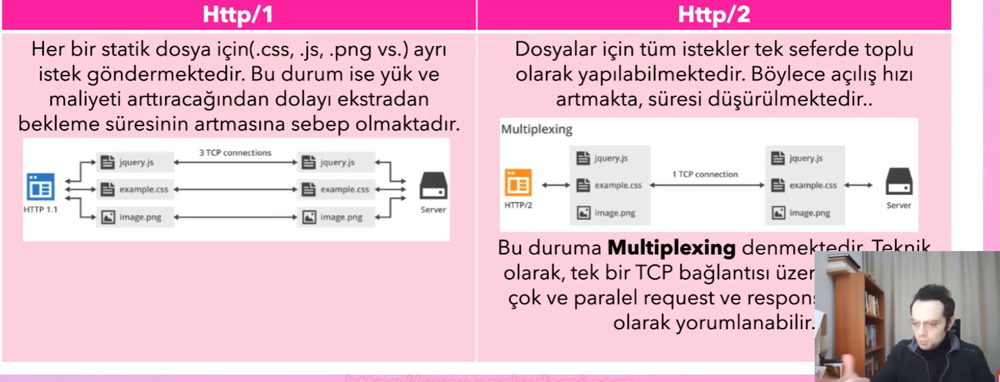
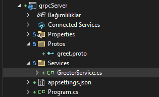
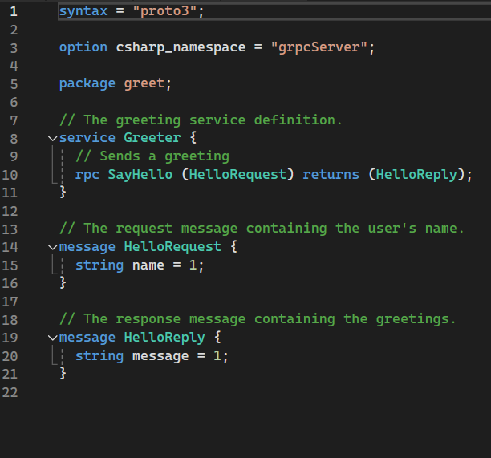
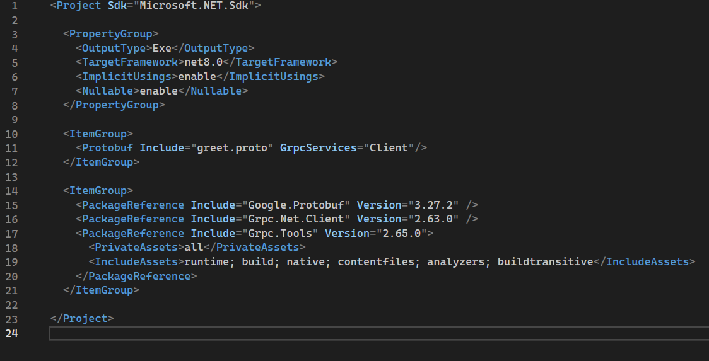
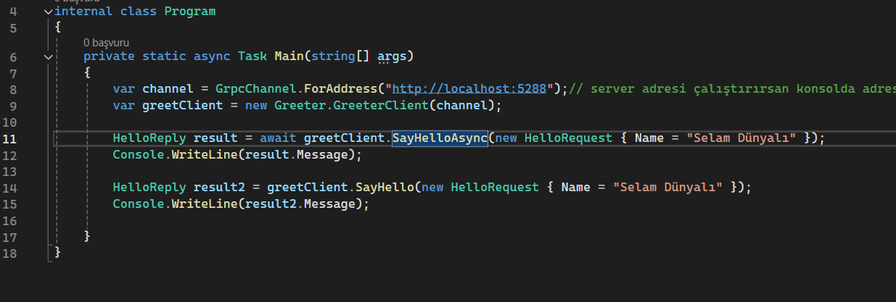
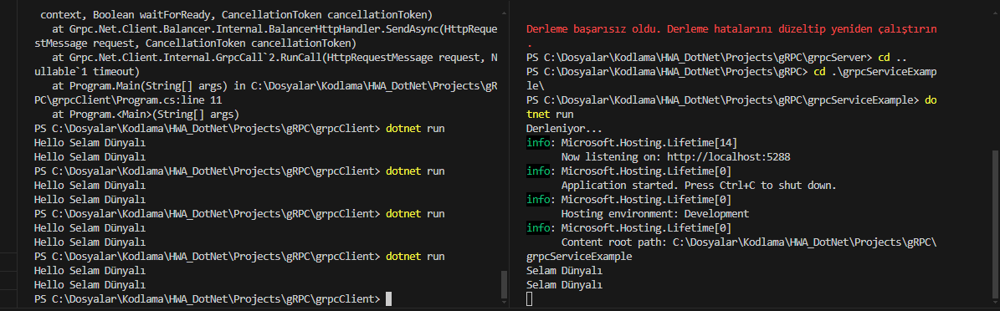
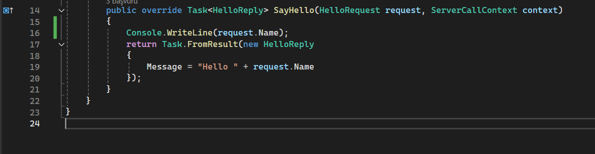

# gRPC  (evet g küçük kalanı büyük)

Google tarafından geliştirilen open source `remote procedure call(RPC)` sistemidir. `RPC` sistemi kısaca kendi uygulamalarında uzaktan gönderdiğin bir kodu gönderdiğin yerde çalıştırmandır. 

 

Http/2 ile iletişim yapar. 

[KAYNAK](https://www.youtube.com/watch?v=FFqg-WhhOw4&list=PLQVXoXFVVtp3oS21qi7a0DZikNPAWxevZ)

 

http/1 her şey için ayrı istek atar. http/2 ise tek istekte hepsini çözer. [Kısaca n to 1 mux donanımının yazılım hali](https://tr.wikipedia.org/wiki/%C3%87oklay%C4%B1c%C4%B1)

 

hızlı kullanışlı bu sebep ile tercih edilir. 

### unary iletişim

tek istek ve tek cevap alınan iletişim türüdür.

### Server Streaming

tek istek karşılığında stream cevap alınmasıdır. yani istek atılır ve çoklu cevap alınır. 

### Client Streaming

Tersidir birden çok istek karşılığında tek cevap olur.

### Bi-Directional Streaming

iki tarafında karşılıklı birden çok istek ve cevap ürettiği türdür. Karşılıklı konuşmadır direkt.

### prote dosyası

client ve server arası iletişimi sağalr.

# Uygulama

` dotnet new grpc --name grpcServer` ile otomatik grpc server oluşturulur

 

burada protos içinde `proto` tanımları yapılır. services içinde ise proto sırasında kullanılacak kalıplar yer alır

 

proto dosyası

 

syntax versiyon gibidir. 3. satırdaki ise namespace belkirtit.

 

|10. satırda  rpc yanındaki request edilecek tr return yanındaki ise response edilecek türdür. 

 

|15. ve 20. satırdaki 1 değerleri döndürme sırasıdır.

 

client projesine üç projeyide kur.

 

server kısmındaki proto dosyasını client içine kopyala. proto birebir aynı olmalı. klasör olarak değil sadece dosya

 

10-11-12 satırlarındaki kodu kendi proje dosyanıza ekleyin client proje dosyası

 

sonra build edin

 

client kısmında program.cs dosyası

 

sonuç bu şekilde

 

gençay yaptı bende server niye yazmıyor diye 1 saat düşündükten sonra 

burada 16. satırdaki kodu girmeyi unutmayın bunuda server kısmında services içindeki dosyaya ekleyeceksiniz
 
temel grpc yapısı taammalandı

# Özel Protolar yapma

