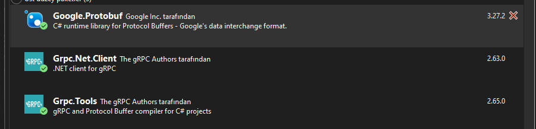

# gRPC  (evet g küçük kalanı büyük)

Google tarafından geliştirilen open source `remote procedure call(RPC)` sistemidir. `RPC` sistemi kısaca kendi uygulamalarında uzaktan gönderdiğin bir kodu gönderdiğin yerde çalıştırmandır. 

 

Http/2 ile iletişim yapar. 

[KAYNAK](https://www.youtube.com/watch?v=FFqg-WhhOw4&list=PLQVXoXFVVtp3oS21qi7a0DZikNPAWxevZ)

 

http/1 her şey için ayrı istek atar. http/2 ise tek istekte hepsini çözer. [Kısaca n to 1 mux donanımının yazılım hali](https://tr.wikipedia.org/wiki/%C3%87oklay%C4%B1c%C4%B1)

 

hızlı kullanışlı bu sebep ile tercih edilir. 

### unary iletişim

tek istek ve tek cevap alınan iletişim türüdür.

### Server Streaming

tek istek karşılığında stream cevap alınmasıdır. yani istek atılır ve çoklu cevap alınır. 

### Client Streaming

Tersidir birden çok istek karşılığında tek cevap olur.

### Bi-Directional Streaming

iki tarafında karşılıklı birden çok istek ve cevap ürettiği türdür. Karşılıklı konuşmadır direkt.

### prote dosyası

client ve server arası iletişimi sağalr.

# Uygulama

` dotnet new grpc --name grpcServer` ile otomatik grpc server oluşturulur

 

burada protos içinde `proto` tanımları yapılır. services içinde ise proto sırasında kullanılacak kalıplar yer alır

 

proto dosyası

 

syntax versiyon gibidir. 3. satırdaki ise namespace belkirtit.

 

|10. satırda  rpc yanındaki request edilecek tr return yanındaki ise response edilecek türdür. 

 

|15. ve 20. satırdaki 1 değerleri döndürme sırasıdır.

 

client projesine üç projeyide kur.

 

server kısmındaki proto dosyasını client içine kopyala. proto birebir aynı olmalı. klasör olarak değil sadece dosya

 

10-11-12 satırlarındaki kodu kendi proje dosyanıza ekleyin client proje dosyası

 

sonra build edin

 

client kısmında program.cs dosyası

 

sonuç bu şekilde

 

gençay yaptı bende server niye yazmıyor diye 1 saat düşündükten sonra 

burada 16. satırdaki kodu girmeyi unutmayın bunuda server kısmında services içindeki dosyaya ekleyeceksiniz
 
temel grpc yapısı taammalandı

# Özel Protolar yapma

### Unary özel örneği

`message.proto` dosyası. 

 
3. satırda özel namespace ismi verdik.
 
5. satırda paket ismini ayarladık.
 
8. satırda servis adını koyduk
 
14. satırda istek için özel method ayarladık. Burada birinci değişken isim ikinci değişken mesajın kendisi dedik.
 
20. satırda cevap methodu ayarladık.
 
sonra buun projeye ekledik.
  

 

şimdi servisi ayarladık. 

 

burayı serverda düzeltmeyi unutmka. client içinde özel proto eklendi ve kodlar ayarlandı

sonuç olarak bu şekilde başardık. 

 

### server stream özel türü

burada da önce 

1- server için proto oluştur
2- server için servis oluştur
3- proje dosyasına tanımlama yap
4- client için proto ekle
5- proje dosyasınam ekle
6- gerekli kodu program.cs içine yaz

program cs kodu client içinde program cs de var

 

proto dosyalarındaki senkronizasyonu unutmayın gene 1 saat hata bulmaya gitti

 

tammaır.

 

### ClientStream özel türü

üstekinini tam tersi kodlar var `MessageClientStream` tabanlı dosyalarda <h1 style="font-size: 100px;">FAKAT VİSUAL STUDİO PROTO DOSYASI AÇARKEN SINIF OLARAK AÇIP SONRA İSİM VE İÇERİK DEĞİŞTİREREK PROTO YAPMAYIN ÇÜNKÜ 1 SAATTİR NİYE PROTO DOSYASINDA GET VE SET İSTİYOR DİYE KAFAYI YİYECEKTİM ARKAPLANDA ONU HALA .CS OALRAK DERLEMEYE ÇALIŞIYOR MUHTEMELEN</h1>
BİLGİLENDİRME BNİTMİŞLTİR

 

 

### Bi-Directional Stream

şeklinde karşılıklı asenkron iletişimdir. sistem biraz karşık aslında sürekli döngüler var ama ayarlanır ilerde. 

